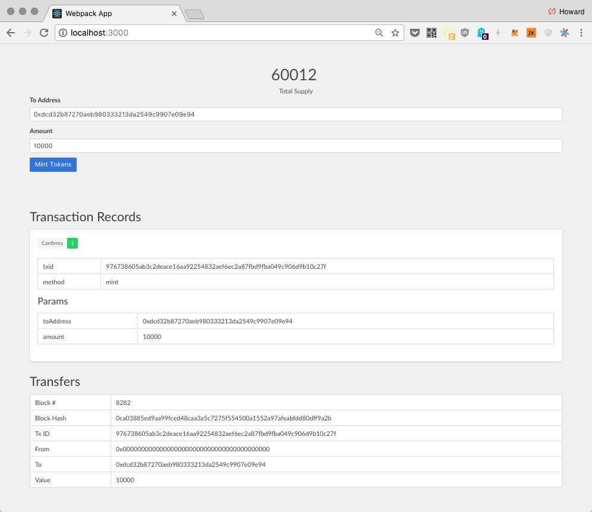

# ERC20 DApp

In this chapter, we'll build a React DApp for the [ERC20 Token we deployed previously](./erc20-token.md).

The features for this DApp are similar to the NodeJS CLI tool we've built. The DApp should:

+ Subscribe to and display token transfer events.
+ Display total supply, and update it automatically.
+ Be able to mint new tokens.
+ Display information about transactions made, e.g. number of confirmations.

It looks something like this:

The only additional complication is that we no longer allow DApp to create a transaction without user permission. Now for every transaction, we should give the user an opportunity to approve or deny it:

